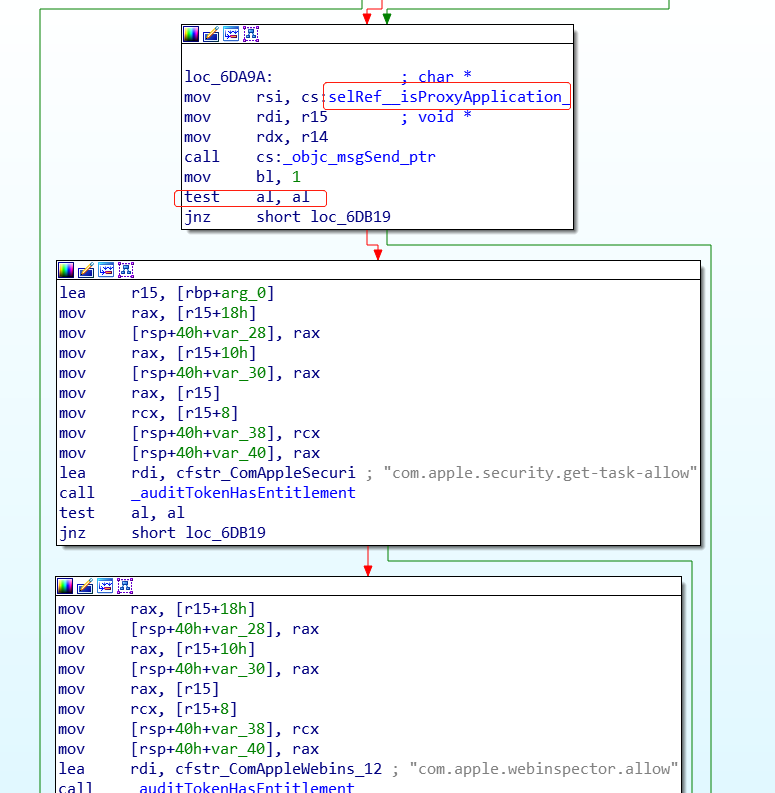
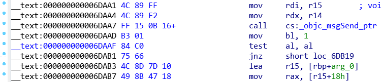
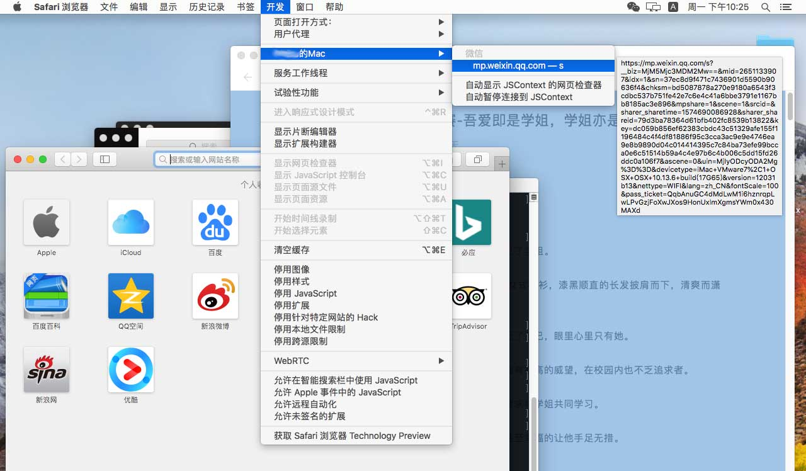
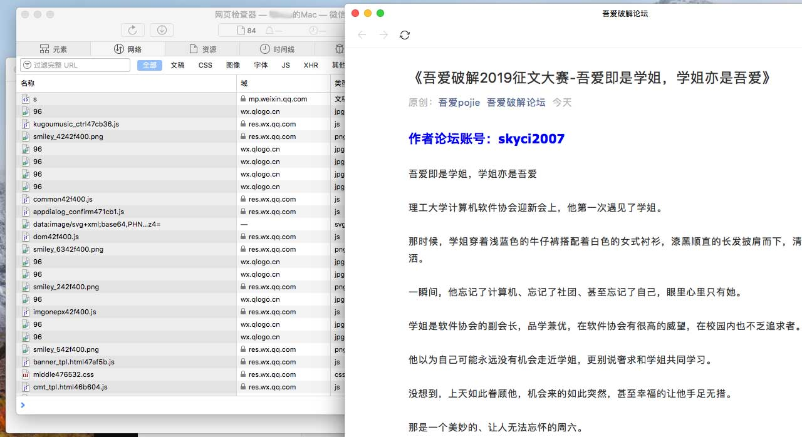

# Enable debugging any App's WebView on MacOS

This is a PoC to enable debugging WebView in any App, by patching `WebInspect` the dylib regulating which App can be debugged by Safari.

The idea is to tweak method `-[RWIRelayDelegateMac _allowApplication:bundleIdentifier:]` to always return TRUE.

As notice from the disassembled flow diagram, function `isProxyApplication` is one of the judgement conditions. Moreover, from the opcodes, we see `bl` is set before test, so we can change `test al, al` to `test bl, bl`.



Just get it done by patching opcode `84 CO` to `84 DB`. However, the location of this opcode may vary in different OS versions. In this example is 0x6daaf. 



### How to use

First of all, disable SIP (System Integrity Protection), otherwise, `task_for_pid` won't work. 

**Warning!** disabling SIP is at your own risk, you should make sure your environment is safe by yourself.
1. Drag `WebInspector` into your favorite disassembler (IDA, Hopper, etc.) and analyze, the path is as below.

```bash
/System/Library/PrivateFrameworks/WebInspector.framework/Versions/A/WebInspector
```
By searching `_allowApplication`, you can locate the method `-[RWIRelayDelegateMac _allowApplication:bundleIdentifier:]`, where you can find the opcodes to test for `isProxyApplication`'s result, as the second image shown above.


Open `main.m`, scroll to the last line of code, change the visual memory address `0x000000000006c660` to that you see on your disassembler.

```c
patch_mem(remoteTask, aslr_offset+0x000000000006c660, sizeof(unsigned short), 0xc084, 0xdb84);
```

2. In your terminal, compile it with make command
```bash
$ make
```

3. Open Safari.app, run with sudo privilege
```bash
$ sudo ./patchwebinspect
```

If the program gives a successful prompt, then you can debug any WebView. This program only patchs memory, so each time Safari relaunches, the effect is gone, and need to re-patch. The following images show WeChat's WebView can be debugged after patched.





### MIT License

Copyright (c) 2019 zwo

Permission is hereby granted, free of charge, to any person obtaining a copy
of this software and associated documentation files (the "Software"), to deal
in the Software without restriction, including without limitation the rights
to use, copy, modify, merge, publish, distribute, sublicense, and/or sell
copies of the Software, and to permit persons to whom the Software is
furnished to do so, subject to the following conditions:

The above copyright notice and this permission notice shall be included in all
copies or substantial portions of the Software.

THE SOFTWARE IS PROVIDED "AS IS", WITHOUT WARRANTY OF ANY KIND, EXPRESS OR
IMPLIED, INCLUDING BUT NOT LIMITED TO THE WARRANTIES OF MERCHANTABILITY,
FITNESS FOR A PARTICULAR PURPOSE AND NONINFRINGEMENT. IN NO EVENT SHALL THE
AUTHORS OR COPYRIGHT HOLDERS BE LIABLE FOR ANY CLAIM, DAMAGES OR OTHER
LIABILITY, WHETHER IN AN ACTION OF CONTRACT, TORT OR OTHERWISE, ARISING FROM,
OUT OF OR IN CONNECTION WITH THE SOFTWARE OR THE USE OR OTHER DEALINGS IN THE
SOFTWARE.